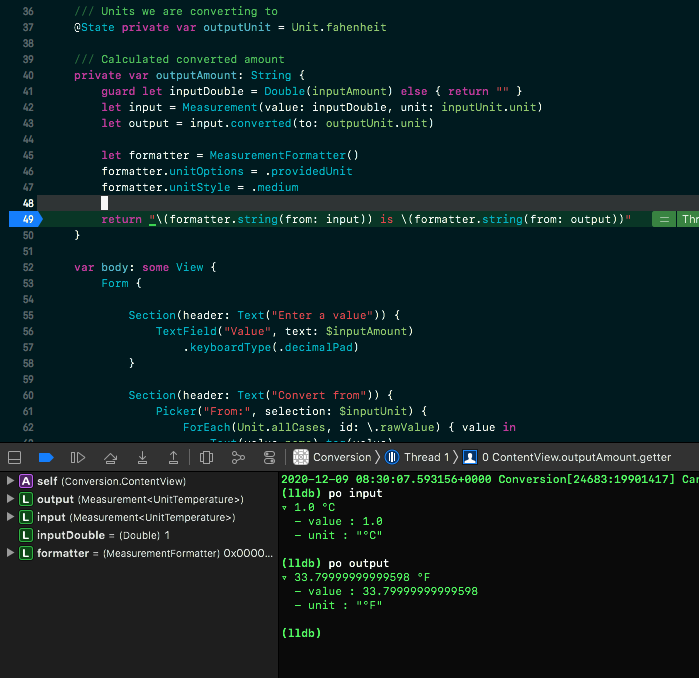

# xcodetheme
Martinsoft Theme for Xcode IDE.

## Overview

A dark but vibrant theme for Xcode, with retro-style blocky cursors and green-screen style console output.

This theme sits somewhere between the default 'Dusk' and 'Midnight' themes, but with blocky cursors, changes to the selection style, and changes to the console formatting. 

## Installation

Copy the `.xccolortheme` file to `~/Library/Developer/Xcode/UserData/FontAndColorThemes` and restart Xcode.

To change your theme:
* open Xcode
* select Xcode > Preferences... > Fonts & Colors 
* choose the 'Martinsoft' theme to apply.

## Updates 

I make tweaks to this theme every now and again, so Star this repo if you'd like to see updates.

## Support

If you enjoy this theme, please let me know on [Instagram (@martinsoft)](https://instagram.com/martinsoft)! 

Feel free to tag me in any images where you are using my theme! I'd love to see it in action! 😊

